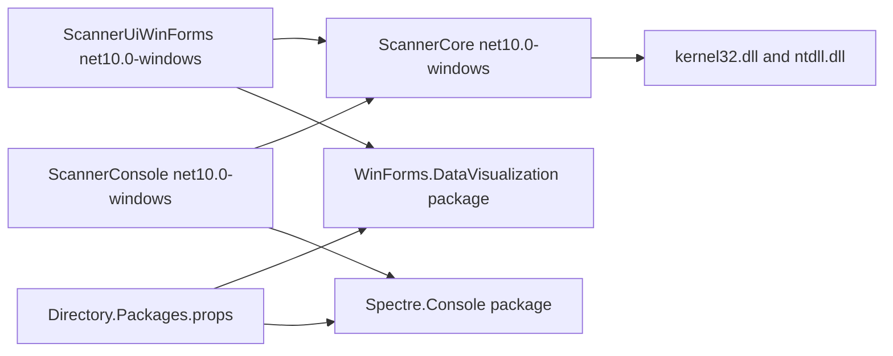

# .NET 10 Migration Implementation Plan

> **For agentic workers:** REQUIRED SUB-SKILL: Use superpowers:subagent-driven-development (recommended) or superpowers:executing-plans to implement this plan task-by-task. Steps use checkbox (`- [ ]`) syntax for tracking.

**Goal:** Migrate SizeScanner from classic .NET Framework 4.8 projects to SDK-style .NET 10 Windows desktop projects without changing scanner or UI behavior.

**Architecture:** Keep the existing dependency flow: `ScannerUiWinForms` and `ScannerConsole` depend on `ScannerCore`, and all filesystem/native enumeration logic remains in `ScannerCore`. Replace the .NET Framework chart assembly with the `WinForms.DataVisualization` NuGet package, and confine `Spectre.Console` to the manual console harness.

**Tech Stack:** .NET 10 SDK, Windows Forms, SDK-style MSBuild projects, central package management, `WinForms.DataVisualization`, `Spectre.Console`, Windows native APIs via P/Invoke.

---

## Target Outcome
Migrate all three projects directly from .NET Framework 4.8 to .NET 10 LTS with no temporary .NET Framework compatibility path. Because SizeScanner is Windows-only and `ScannerCore` depends on Windows native APIs, target `net10.0-windows` across the solution.



## Files To Change
- [Directory.Packages.props](Directory.Packages.props): create central package management and define all NuGet package versions in one place.
- [Directory.Build.props](Directory.Build.props): create shared SDK project defaults for analysis/build consistency if the final project files would otherwise duplicate the same properties.
- [ScannerCore/ScannerCore.csproj](ScannerCore/ScannerCore.csproj): convert to SDK-style library project targeting `net10.0-windows`.
- [ScannerConsole/ScannerConsole.csproj](ScannerConsole/ScannerConsole.csproj): convert to SDK-style console project targeting `net10.0-windows` and add a versionless `Spectre.Console` package reference.
- [ScannerUiWinForms/ScannerUiWinForms.csproj](ScannerUiWinForms/ScannerUiWinForms.csproj): convert to SDK-style WinForms project targeting `net10.0-windows`, add `UseWindowsForms`, configure high DPI defaults, keep the manifest, and add a versionless charting package reference.
- [ScannerUiWinForms/Program.cs](ScannerUiWinForms/Program.cs): move startup to modern WinForms application initialization.
- [ScannerUiWinForms/app.manifest](ScannerUiWinForms/app.manifest): keep UAC/common-controls/OS compatibility entries, remove DPI declarations that should move to project/startup configuration.
- [ScannerUiWinForms/App.config](ScannerUiWinForms/App.config) and [ScannerConsole/App.config](ScannerConsole/App.config): remove .NET Framework startup config; delete the files if nothing remains.
- [ScannerUiWinForms/Properties/Settings.settings](ScannerUiWinForms/Properties/Settings.settings) and [ScannerUiWinForms/Properties/Settings.Designer.cs](ScannerUiWinForms/Properties/Settings.Designer.cs): remove because settings are empty and otherwise pull in `System.Configuration` needlessly.
- [ScannerCore/DirectoryScanner.cs](ScannerCore/DirectoryScanner.cs): verify native marshalling under .NET 10 and update obsolete/unsafe marshalling patterns only where build or runtime validation requires it.
- [ScannerConsole/Program.cs](ScannerConsole/Program.cs): make the manual harness accept a path argument and use `Spectre.Console` for progress/status output so scanner validation is repeatable without editing source.
- [README.md](README.md) and [AGENTS.md](AGENTS.md): update build/run guidance from .NET Framework 4.8/MSBuild to .NET 10 SDK commands.

## Analysis Additions
- Current project files are classic MSBuild projects with explicit `Compile`, `EmbeddedResource`, `None`, and framework `Reference` item groups. SDK-style projects include source/resource files by default, so the migration must not copy those item groups verbatim or the build can fail with duplicate item errors.
- Each project already has `Properties/AssemblyInfo.cs` with version and COM GUID metadata. The first migration pass should set `GenerateAssemblyInfo=false` in every project and keep those files unchanged.
- `ScannerUiWinForms/Properties/Settings.settings` contains no settings. `Settings.Designer.cs` only inherits `System.Configuration.ApplicationSettingsBase`, so deleting both avoids adding `System.Configuration.ConfigurationManager` just to satisfy unused generated code.
- The solution currently uses the classic C# project type GUID in `SizeScanner.sln`. Do not hand-edit the solution unless `dotnet build` or Visual Studio reload requires it. If Visual Studio updates project type GUIDs after SDK conversion, accept that one-time solution change and verify the existing project identity GUIDs remain stable.
- `DriveScanner.Progress` only produces useful percentages for `ScanDrive`, because `_occupied` is initialized from `DriveInfo` there. The console harness should show an indeterminate status for `ScanDirectory(path, token)` rather than a misleading percentage progress bar.
- `WinForms.DataVisualization` latest stable observed during plan review: `1.10.0`. It is a community continuation of the .NET Framework chart library and documents breaking changes; the migration must smoke-test chart creation, hit testing, custom properties, and designer reload.
- `Spectre.Console` latest stable observed during plan review: `0.55.2`. Keep it confined to `ScannerConsole`.

## Exact Project File Targets
Use these as the starting project-file contents. Keep XML minimal and add metadata back only when a build, designer reload, or resource generation check proves it is required.

`ScannerCore/ScannerCore.csproj`:

```xml
<Project Sdk="Microsoft.NET.Sdk">
  <PropertyGroup>
    <TargetFramework>net10.0-windows</TargetFramework>
    <RootNamespace>ScannerCore</RootNamespace>
    <AssemblyName>ScannerCore</AssemblyName>
    <GenerateAssemblyInfo>false</GenerateAssemblyInfo>
  </PropertyGroup>
</Project>
```

`ScannerConsole/ScannerConsole.csproj`:

```xml
<Project Sdk="Microsoft.NET.Sdk">
  <PropertyGroup>
    <OutputType>Exe</OutputType>
    <TargetFramework>net10.0-windows</TargetFramework>
    <RootNamespace>ScannerConsole</RootNamespace>
    <AssemblyName>ScannerConsole</AssemblyName>
    <GenerateAssemblyInfo>false</GenerateAssemblyInfo>
  </PropertyGroup>

  <ItemGroup>
    <ProjectReference Include="..\ScannerCore\ScannerCore.csproj" />
    <PackageReference Include="Spectre.Console" />
  </ItemGroup>
</Project>
```

`ScannerUiWinForms/ScannerUiWinForms.csproj`:

```xml
<Project Sdk="Microsoft.NET.Sdk">
  <PropertyGroup>
    <OutputType>WinExe</OutputType>
    <TargetFramework>net10.0-windows</TargetFramework>
    <UseWindowsForms>true</UseWindowsForms>
    <RootNamespace>ScannerUiWinForms</RootNamespace>
    <AssemblyName>ScannerUiWinForms</AssemblyName>
    <GenerateAssemblyInfo>false</GenerateAssemblyInfo>
    <ApplicationManifest>app.manifest</ApplicationManifest>
    <ApplicationHighDpiMode>PerMonitorV2</ApplicationHighDpiMode>
    <ApplicationVisualStyles>true</ApplicationVisualStyles>
    <ApplicationUseCompatibleTextRendering>false</ApplicationUseCompatibleTextRendering>
  </PropertyGroup>

  <ItemGroup>
    <ProjectReference Include="..\ScannerCore\ScannerCore.csproj" />
    <PackageReference Include="WinForms.DataVisualization" />
  </ItemGroup>

  <ItemGroup>
    <EmbeddedResource Update="Form1.resx">
      <DependentUpon>Form1.cs</DependentUpon>
    </EmbeddedResource>
    <EmbeddedResource Update="Properties\Resources.resx">
      <Generator>ResXFileCodeGenerator</Generator>
      <LastGenOutput>Resources.Designer.cs</LastGenOutput>
      <SubType>Designer</SubType>
    </EmbeddedResource>
    <Compile Update="Properties\Resources.Designer.cs">
      <AutoGen>True</AutoGen>
      <DependentUpon>Resources.resx</DependentUpon>
      <DesignTime>True</DesignTime>
    </Compile>
  </ItemGroup>
</Project>
```

## Central Package And Build Defaults
Create `Directory.Packages.props` at the repository root:

```xml
<Project>
  <PropertyGroup>
    <ManagePackageVersionsCentrally>true</ManagePackageVersionsCentrally>
  </PropertyGroup>

  <ItemGroup>
    <PackageVersion Include="WinForms.DataVisualization" Version="1.10.0" />
    <PackageVersion Include="Spectre.Console" Version="0.55.2" />
  </ItemGroup>
</Project>
```

Create `Directory.Build.props` only with migration-safe defaults:

```xml
<Project>
  <PropertyGroup>
    <ImplicitUsings>disable</ImplicitUsings>
    <Nullable>disable</Nullable>
    <AnalysisLevel>latest</AnalysisLevel>
    <Deterministic>true</Deterministic>
  </PropertyGroup>
</Project>
```

Do not add `WarningsAsErrors` in this migration. First reach clean restore/build/runtime validation, then consider analyzer tightening in a separate change.

## Startup, DPI, And Manifest Details
Replace `ScannerUiWinForms/Program.cs` with:

```csharp
using System;
using System.Windows.Forms;

namespace ScannerUiWinForms
{
    internal static class Program
    {
        [STAThread]
        private static void Main()
        {
            ApplicationConfiguration.Initialize();
            Application.Run(new Form1());
        }
    }
}
```

Delete `ScannerUiWinForms/App.config` and `ScannerConsole/App.config`. In `ScannerUiWinForms/app.manifest`, remove only this DPI block:

```xml
<application xmlns="urn:schemas-microsoft-com:asm.v3">
  <windowsSettings>
    <dpiAware xmlns="http://schemas.microsoft.com/SMI/2005/WindowsSettings">true/pm</dpiAware>
    <dpiAwareness xmlns="http://schemas.microsoft.com/SMI/2016/WindowsSettings">PerMonitorV2</dpiAwareness>
  </windowsSettings>
</application>
```

Keep `requestedExecutionLevel`, the existing supported-OS compatibility entries, and the common-controls v6 dependency. Document in `README.md` that the migrated app requires Windows versions supported by .NET 10, even though the legacy manifest compatibility entries remain.

## Console Harness Target Code
Replace `ScannerConsole/Program.cs` with a non-interactive path-based harness. It should report status instead of percentage progress for directory scans:

```csharp
using System;
using System.Diagnostics;
using System.IO;
using System.Threading;
using ScannerCore;
using Spectre.Console;

namespace ScannerConsole
{
    internal static class Program
    {
        private static int Main(string[] args)
        {
            var target = args.Length > 0
                ? args[0]
                : Environment.GetFolderPath(Environment.SpecialFolder.UserProfile);

            if (!Directory.Exists(target))
            {
                AnsiConsole.MarkupLine($"[red]Directory does not exist:[/] {Markup.Escape(target)}");
                return 1;
            }

            var scanner = new DriveScanner();
            FsItem root = null;
            Exception failure = null;
            var elapsed = Stopwatch.StartNew();

            var worker = new Thread(() =>
            {
                try
                {
                    root = scanner.ScanDirectory(target, CancellationToken.None);
                }
                catch (Exception ex)
                {
                    failure = ex;
                }
            });

            AnsiConsole.MarkupLine($"[bold]Scanning:[/] {Markup.Escape(target)}");
            worker.Start();

            AnsiConsole.Status()
                .Spinner(Spinner.Known.Dots)
                .Start("Scanning directory tree...", ctx =>
                {
                    while (worker.IsAlive)
                    {
                        var current = scanner.CurrentScanned ?? target;
                        ctx.Status($"Scanning {Markup.Escape(current)}");
                        Thread.Sleep(250);
                    }
                });

            worker.Join();
            elapsed.Stop();

            if (failure != null)
            {
                AnsiConsole.WriteException(failure);
                return 1;
            }

            if (root == null)
            {
                AnsiConsole.MarkupLine("[red]Scan did not return a root item.[/]");
                return 1;
            }

            AnsiConsole.MarkupLine($"[green]Complete[/] in {elapsed.Elapsed.TotalSeconds:F2} seconds");
            AnsiConsole.MarkupLine($"[bold]Total size:[/] {Markup.Escape(Humanize.Size(root.Size))}");

            var table = new Table { Title = new TableTitle("Inaccessible Paths") };
            table.AddColumn("Path");
            foreach (var path in scanner.Inaccessible)
            {
                table.AddRow(Markup.Escape(path));
            }
            AnsiConsole.Write(table);

            return 0;
        }
    }
}
```

Expected harness behavior:
- Missing path returns exit code `1` and prints `Directory does not exist`.
- Valid path returns exit code `0`, prints elapsed time and total size, and renders an inaccessible-paths table.
- No prompt or `Console.ReadKey()` remains, so `dotnet run` and script-based validation do not hang.

## Validation Matrix
- Project conversion: `rtk dotnet restore SizeScanner.sln`; expected `Restore succeeded` with no package version warnings from project-local `Version` attributes.
- Debug build: `rtk dotnet build SizeScanner.sln -c Debug`; expected all three projects compile.
- Release build: `rtk dotnet build SizeScanner.sln -c Release`; expected all three projects compile.
- Console missing-path check: `rtk dotnet run --project .\ScannerConsole\ScannerConsole.csproj -- .\path-that-does-not-exist`; expected exit code `1`.
- Console safe-path check: `rtk dotnet run --project .\ScannerConsole\ScannerConsole.csproj -- "$env:USERPROFILE"`; expected exit code `0`, elapsed time, total size, and inaccessible-path table.
- Native enumeration smoke test: create a temp folder with one normal file, one nested folder, and one symlink or junction. Add a OneDrive online-only file when the machine has OneDrive Files On-Demand configured; when it does not, record `OneDrive offline-file case not exercised` in the validation notes. Expected normal/nested files count toward size, reparse points are skipped, and offline files are still represented according to existing `DirectoryScanner` behavior.
- UI smoke test: `rtk dotnet run --project .\ScannerUiWinForms\ScannerUiWinForms.csproj`; expected the app starts, drive buttons populate, chart renders doughnut slices after a scan, and tooltips/context menu actions still map slices back to `FsItem`.
- Designer smoke test: open `ScannerUiWinForms/Form1.cs` in the Visual Studio WinForms designer after restore. Expected designer loads without removing the `Chart` control or rewriting the file into an unusable state.
- Publish smoke test: `rtk dotnet publish .\ScannerUiWinForms\ScannerUiWinForms.csproj -c Release -r win-x64 --self-contained false`; expected publish output contains `ScannerUiWinForms.exe` and required chart package assemblies.

## Phase 1: Baseline And Tooling
- Install the latest patched .NET 10 SDK and Visual Studio with the .NET desktop development workload.
- Record the current behavior before changes:
  - Build current solution with Visual Studio MSBuild: `rtk msbuild SizeScanner.sln /p:Configuration=Debug`.
  - Launch the current WinForms app and note chart rendering, high-DPI layout, drive buttons, tooltip behavior, inaccessible list, Explorer open action, and delete prompt behavior.
  - Run the console harness after temporarily pointing it at a small accessible folder.
- Commit or stash unrelated work before implementation starts so project-file conversion is easy to review.

## Phase 2: Convert Project Files And Centralize Packages
- Replace classic project XML with SDK-style project files.
- Preserve existing assembly metadata by setting `GenerateAssemblyInfo` to `false` initially, keeping the current `Properties/AssemblyInfo.cs` files in place.
- Keep `ImplicitUsings` and `Nullable` disabled for the first migration pass to avoid mixing framework migration with broader source modernization.
- Add [Directory.Packages.props](Directory.Packages.props) with central package management enabled. Project files must contain only versionless `PackageReference` items; all package versions belong in this file.
- Add central package entries for:
  - `WinForms.DataVisualization` `1.10.0`.
  - `Spectre.Console` `0.55.2`.
- Add [Directory.Build.props](Directory.Build.props) only for shared project settings that genuinely apply to all projects. Good candidates are `AnalysisLevel=latest`, `EnforceCodeStyleInBuild=true`, deterministic builds, and the common `ImplicitUsings`/`Nullable` migration defaults. Avoid enabling broad warnings-as-errors until the first clean .NET 10 build is reached.
- Expected project properties:
  - `ScannerCore`: `Microsoft.NET.Sdk`, `TargetFramework=net10.0-windows`, `OutputType` omitted, `GenerateAssemblyInfo=false`.
  - `ScannerConsole`: `Microsoft.NET.Sdk`, `OutputType=Exe`, `TargetFramework=net10.0-windows`, project reference to `ScannerCore`, versionless `PackageReference Include="Spectre.Console"`.
  - `ScannerUiWinForms`: `Microsoft.NET.Sdk`, `OutputType=WinExe`, `TargetFramework=net10.0-windows`, `UseWindowsForms=true`, `ApplicationManifest=app.manifest`, `ApplicationHighDpiMode=PerMonitorV2`, `ApplicationVisualStyles=true`, `ApplicationUseCompatibleTextRendering=false`, versionless `PackageReference Include="WinForms.DataVisualization"`.
- Add `WinForms.DataVisualization` to the UI project using NuGet rather than a framework assembly reference. Keep `System.Windows.Forms.DataVisualization.Charting` namespaces unless the package requires a compile-time adjustment.
- Use `WinForms.DataVisualization` `1.10.0` and `Spectre.Console` `0.55.2` as the initial central package versions. If restore fails because the chart package lacks a compatible `net10.0-windows` asset, stop and evaluate the package release notes before changing chart libraries.

## Phase 3: Remove .NET Framework Configuration Assumptions
- Delete or stop including `ScannerConsole/App.config` and `ScannerUiWinForms/App.config`; the existing files only contain .NET Framework startup and DPI config.
- Remove the empty generated settings files from the UI project to avoid adding `System.Configuration.ConfigurationManager` for unused settings.
- Update `ScannerUiWinForms/Program.cs` to use modern WinForms initialization:

```csharp
[STAThread]
static void Main()
{
    ApplicationConfiguration.Initialize();
    Application.Run(new Form1());
}
```

- Remove DPI entries from `app.manifest` so DPI is controlled by `ApplicationHighDpiMode=PerMonitorV2`; keep `requestedExecutionLevel`, supported Windows versions, and common-controls v6.

## Phase 4: Fix Build Breaks And Compatibility Issues
- Run restore/build after project conversion:
  - `rtk dotnet restore SizeScanner.sln`
  - `rtk dotnet build SizeScanner.sln -c Debug`
  - `rtk dotnet build SizeScanner.sln -c Release`
- Resolve expected issue areas in this order:
  - Chart package compatibility in `Form1.cs` and `Form1.Designer.cs`.
  - Generated resource/designer behavior for `Form1.resx` and `Properties/Resources.resx`.
  - Native marshalling warnings or runtime failures in `DirectoryScanner.cs`, especially `Marshal.PtrToStructure`, `Marshal.PtrToStringUni`, and the unmanaged buffer lifetime.
  - WinForms high-DPI warnings such as manifest DPI configuration warnings.
- Keep scanner filesystem logic inside `ScannerCore`; do not move P/Invoke into the UI.

## Phase 5: Improve The Manual Harness
- Update `ScannerConsole/Program.cs` to accept a path argument and default to a small safe folder such as the user profile when no argument is passed.
- Use `Spectre.Console` for readable validation output:
  - Print the target path and final elapsed time with `AnsiConsole.MarkupLine`.
  - Render an indeterminate `AnsiConsole.Status()` spinner while polling `DriveScanner.CurrentScanned`.
  - Do not display `DriveScanner.Progress` for directory scans; `ScanDirectory` does not initialize `_occupied`, so the percentage remains `0`.
  - Show inaccessible paths in a `Table` after the scan completes.
  - Keep the harness non-interactive by default so it remains scriptable from `dotnet run`; prompts should be avoided unless explicitly requested later.
- Keep it as a manual perf/progress harness, not a shipped app.
- Validate with:
  - `rtk dotnet run --project .\ScannerConsole\ScannerConsole.csproj -- "$env:USERPROFILE"`
  - A small temp directory containing normal files, nested directories, an inaccessible folder if available, and a symlink/reparse-point case if practical.

## Phase 6: Manual UI Validation
- Launch the migrated app with:
  - `rtk dotnet run --project .\ScannerUiWinForms\ScannerUiWinForms.csproj`
- Validate the main user paths:
  - Drive buttons populate from ready drives.
  - Scan progress updates while scanning.
  - Nested doughnut chart renders with the same filter thresholds.
  - Free-space hide/show behavior preserves `[Free space]` and `[Inaccessible]` ordering assumptions.
  - Tooltips still map chart slices back to `FsItem` paths.
  - Explorer open/select still works through `explorer.exe`.
  - Delete prompt still appears and handles failure safely; use only disposable test files.
  - High-DPI layout remains usable on the target monitor scale.

## Phase 7: Publish And Documentation
- Publish a framework-dependent Windows build first:
  - `rtk dotnet publish .\ScannerUiWinForms\ScannerUiWinForms.csproj -c Release -r win-x64 --self-contained false`
- Optionally publish self-contained after the framework-dependent build is validated:
  - `rtk dotnet publish .\ScannerUiWinForms\ScannerUiWinForms.csproj -c Release -r win-x64 --self-contained true`
- Update documentation:
  - `README.md`: .NET 10 SDK requirement, `dotnet build`, `dotnet run`, and `dotnet publish` commands.
  - `AGENTS.md`: replace .NET Framework 4.8 Developer Pack/MSBuild guidance with .NET 10 SDK guidance, and document the required chart package.

## Commit Strategy
Use focused conventional commits:
- `chore: convert projects to sdk style net10`
- `chore: centralize package versions`
- `fix: migrate winforms startup and dpi config`
- `fix: restore charting on modern winforms`
- `chore: improve scanner console harness`
- `docs: update dotnet 10 build guidance`

## Main Risks
- `System.Windows.Forms.DataVisualization` is not part of modern .NET; the chart package is the required compatibility replacement and may have designer/runtime differences.
- Central package management makes package updates explicit, but it also means project files must not carry individual `Version` attributes.
- `Spectre.Console` improves the manual harness but should stay confined to `ScannerConsole`; `ScannerCore` must remain UI/console-framework independent.
- The scanner depends on native Windows directory enumeration; successful compilation is not enough, so the migration needs real filesystem scans.
- DPI behavior can shift because the current app config and manifest both declare DPI behavior; modern WinForms should have one source of truth.
- SDK-style projects include files by default, so explicit item lists from classic project files must not be blindly copied or they may create duplicate compile/resource entries.

## Self-Review
- The plan covers all current projects in `SizeScanner.sln` and the direct migration choice the user selected.
- No unresolved placeholders remain; central package management, dependency replacement, project conversion, console harness modernization, source cleanup, validation, publishing, and docs are all represented.
- The plan preserves existing architecture: UI/Console depend on `ScannerCore`, and all filesystem logic stays in `ScannerCore`.