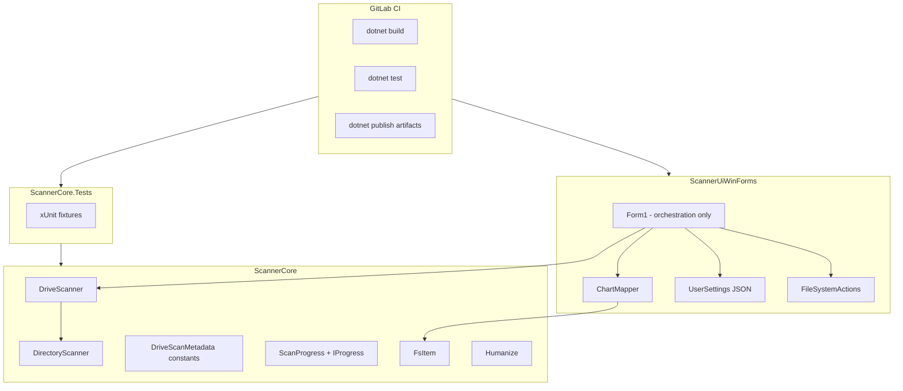

# SizeScanner Modernization Design

**Date:** 2026-06-11  
**Status:** Approved approach — Balanced (D): foundation first, then UX  
**Scope:** WinForms app remains; no platform rewrite

---

## Goal

Modernize SizeScanner into a maintainable, testable, shippable Windows desktop app while preserving current scanner behavior and chart UX. Deliver engineering foundation first, then user-facing improvements on top of that foundation.

## Non-goals

- Replacing WinForms with WPF, Avalonia, or WinUI
- Cross-platform support
- Automatic scanning at startup
- Cloud telemetry or crash reporting (may be revisited later)

## Current baseline

| Area | State |
|------|-------|
| Runtime | .NET 10 (`net10.0-windows`), SDK-style projects |
| Packages | Central management via `Directory.Packages.props` |
| UI | WinForms + `WinForms.DataVisualization`; `Form1.cs` ~730 lines |
| Core | `DriveScanner`, `DirectoryScanner` (NtQueryDirectoryFile P/Invoke), `FsItem`, `Humanize` |
| Quality | No tests, no CI, `Nullable`/`ImplicitUsings` disabled |
| Distribution | Manual `dotnet publish`; no license file |

## Architecture after modernization



Dependency flow unchanged: **UI → Core**. New types live in `ScannerCore` unless they are WinForms-specific (chart mapping, settings path, Explorer/delete).

## Phase overview

| Phase | Name | Outcome |
|-------|------|---------|
| 1 | Engineering foundation | Tests, CI, editorconfig, SDK pin, nullable core |
| 2 | Scanner API hardening | Named synthetic entries, `ScanProgress`, stable public API |
| 3 | UI architecture | Extract chart mapper and filesystem helpers from `Form1.cs` |
| 4 | UX improvements | Folder picker, rescan, settings persistence, recycle-bin delete |
| 5 | Release engineering | License, semver, CI publish, docs |

Each phase produces shippable software. Phases 1–2 must complete before Phase 3; Phase 4 depends on Phase 3; Phase 5 can start after Phase 1.

---

## Phase 1: Engineering foundation

### Testing strategy

Add `ScannerCore.Tests` (xUnit) targeting `net10.0-windows`. Tests run on Windows only (native scanner); CI runners must be Windows.

**Priority test targets:**

1. `Humanize.Size` / `Humanize.FsItem` — pure functions, fast, no I/O
2. `DriveScanner.GetDisplayThreshold` — characterize current directory-scan threshold behavior for included and excluded free space; use temp directory fixtures
3. `DriveScanMetadata` (new) — synthetic entry names and index constants
4. Directory scan smoke — small temp tree with known file sizes

**Fixture approach:** `TemporaryDirectory` creates a disposable tree under `%TEMP%`. No mocking of P/Invoke; integration-style tests against real filesystem.

### CI pipeline

GitLab CI (`.gitlab-ci.yml`):

- **build** — `dotnet restore`, `dotnet build -c Release`
- **test** — `dotnet test -c Release` (Windows runner tag; test job is self-contained and does not depend on build artifacts from a previous job)
- **format** (optional, non-blocking initially) — `dotnet format --verify-no-changes`

### Code quality defaults

- `.editorconfig` — .NET defaults, 4-space indent, final newline
- `global.json` — pin SDK `10.0.100` (adjust to installed SDK)
- `Directory.Build.props` — enable `Nullable` for `ScannerCore` only initially via `Directory.Build.props` + project override
- Unify `GenerateAssemblyInfo` — `true` everywhere, remove hand-written `Properties/AssemblyInfo.cs` where redundant

### Cleanup

- Confirm `App.config` removed from all projects (already done in UI; verify console)
- Add test project to `SizeScanner.sln`

---

## Phase 2: Scanner API hardening

### Problem

`Form1.cs` uses magic index `root.Items[1]` for inaccessible size. Synthetic entry ordering is implicit knowledge spread across UI and docs.

### Solution

Introduce `DriveScanMetadata` in `ScannerCore`:

```csharp
public static class DriveScanMetadata
{
    public const string FreeSpaceName = "[Free space]";
    public const string InaccessibleName = "[Inaccessible]";
    public const int FreeSpaceIndex = 0;
    public const int InaccessibleIndex = 1;
    public const int SyntheticEntryCount = 2;
}
```

Add helper on `FsItem` or extension:

```csharp
public static FsItem GetInaccessibleEntry(FsItem driveRoot)
    => driveRoot.Items[DriveScanMetadata.InaccessibleIndex];
```

### Progress reporting

Add immutable `ScanProgress` record and optional `IProgress<ScanProgress>` parameter on scan methods. Keep existing `Progress`, `CurrentScanned`, `CurrentTarget` properties for backward compatibility; update them from the progress reporter internally.

`ScanProgress` fields: `CurrentPath`, `BytesScanned`, `PercentComplete` (nullable for directory scans), `IsDriveScan`.

UI: replace `scanProgressTimer` polling with `Progress<ScanProgress>` callback marshalled to UI thread; keep 300 ms throttle in the reporter to avoid excessive `Invoke` calls.

Console harness: consume `IProgress<ScanProgress>` in Spectre status loop instead of reading mutable properties.

---

## Phase 3: UI architecture

### ChartMapper extraction

Move from `Form1.cs` into `ScannerUiWinForms/ChartMapper.cs`:

- `LoadChartDataCollection` and related chart series logic
- Placeholder tag handling
- HSB color generation
- `AlignDoughnuts`
- Filter threshold application (accepts `FsItem` root + threshold + includeFreeSpace flag)

`Form1` retains: event wiring, scan lifecycle, tooltip hit-testing (chart-control specific), context menu.

Target: reduce `Form1.cs` to ~400 lines.

### FileSystemActions

Extract `StartExplorer`, `StartExplorerSelect`, delete-with-confirmation into `FileSystemActions.cs`. Delete method gains `useRecycleBin` parameter (Phase 4).

### ScanSession

Small state object holding `_scanner`, `_scanRoot`, `_scanCts`, last scan target path. `Form1` delegates scan start/cancel/rescan to session methods.

---

## Phase 4: UX improvements

All features behind existing toolbar; no redesign of chart interaction model.

| Feature | Behavior |
|---------|----------|
| **Browse folder** | Toolbar button opens `FolderBrowserDialog`; runs `ScanDirectory` on chosen path |
| **Rescan** | Re-runs last scan target (drive or folder) with current filter settings |
| **Settings persistence** | JSON in `%AppData%/SizeScanner/settings.json`: filter index, free-space visibility, window size, splitter distance, inaccessible pane collapsed |
| **Recycle Bin delete** | Context menu "Delete" uses `Microsoft.VisualBasic.FileIO.FileSystem.DeleteFile/DeleteDirectory` with `SendToRecycleBin`; add a separate "Delete permanently" menu item for the current destructive behavior |
| **Keyboard shortcuts** | `F5` rescan, `Esc` cancel scan, `Ctrl+O` browse folder |

Settings load on `Form1_Load`, save on `FormClosing` and when display options change.

### Dark mode

**Deferred** to a follow-up. WinForms system theme awareness is limited; a proper dark mode requires custom renderer work and is out of scope for this phase.

---

## Phase 5: Release engineering

- Add `LICENSE` (MIT, unless owner specifies otherwise)
- Add `MinVer` package for automatic semver from git tags
- CI `publish` job: `dotnet publish ScannerUiWinForms -c Release -r win-x64 --self-contained false` → artifacts
- Update `README.md` and `AGENTS.md` with test/CI/publish instructions

---

## Error handling principles

- Scanner: denied directories continue to return `null` items list; paths logged in `Inaccessible` — no change
- UI: retain `MessageBox` for destructive actions; no global exception handler in v1
- Delete: distinguish file-not-found (inform user) from access denied (show error)

## Testing matrix (manual, post-Phase 4)

| Scenario | Validate |
|----------|----------|
| Drive scan C:\ | Progress, chart, inaccessible pane |
| Folder browse | Directory scan, no synthetic free-space slice |
| Cancel mid-scan | Clean UI state, no orphan timer |
| Rescan after delete | Updated chart |
| Settings restart | Filter and layout restored |
| Recycle bin delete | Item in Recycle Bin, not gone permanently |
| Admin relaunch | Still works when inaccessible paths exist |

## Risk register

| Risk | Mitigation |
|------|------------|
| Chart regression after `ChartMapper` extraction | Characterization test optional; mandatory manual chart smoke checklist |
| CI needs Windows runner | Document runner tag requirement; build-only job on Linux as optional fast feedback |
| Nullable enablement breaks P/Invoke structs | Enable nullable only in `ScannerCore` non-P/Invoke files first, or suppress in `DirectoryScanner.cs` initially |
| `FolderBrowserDialog` deprecated | Accept for WinForms v1; migrate to `OpenFolderDialog` when targeting newer Windows SDK |

## Success criteria

1. `dotnet test` passes on Windows with ≥15 tests covering `Humanize`, thresholds, and metadata
2. GitLab CI green on default branch
3. `Form1.cs` under 450 lines after Phase 3
4. Browse, rescan, settings persistence, and recycle-bin delete work without chart regressions
5. Published artifact produced by CI or documented one-command publish
